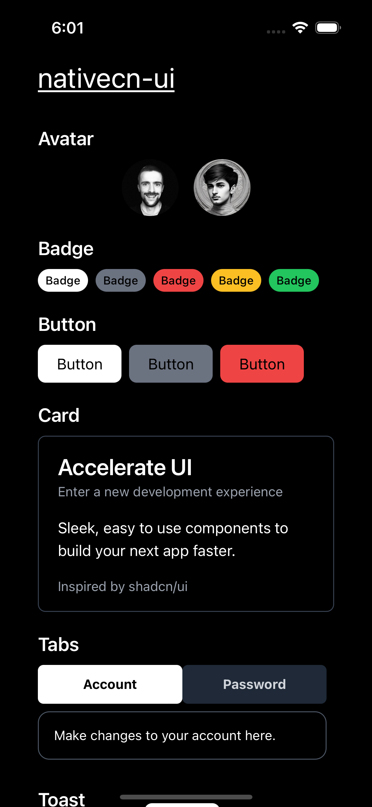
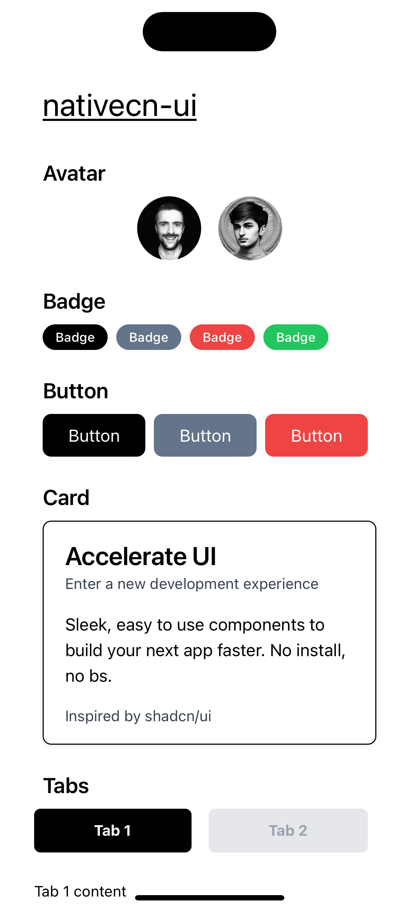

# nativecn-ui

Beautiful and customizable React Native components, inspired by [shadcn-ui](https://github.com/shadcn-ui/ui).

Start building apps faster.

|               Dark mode               |               Light mode               |
| :-----------------------------------: | :------------------------------------: |
|  |  |

## Usage

### How do I run this locally?

```bash
# Clone the repo and cd into it
git clone git@github.com:Swiftcn-UI/nativecn-ui.git
cd nativecn-ui/

# Install deps
yarn

# Run it with Expo
yarn start
```

### How do I add components to my Expo project?

We have an npx command for that.

```bash
# Run this inside your project's root dir
npx nativecn-ui add Button
```

## Components

- [x] Avatar
- [x] Badge
- [x] Button
- [x] Card
- [x] Tabs
- [x] Toast
- [x] Toggle
- [ ] Calendar (WIP)
- [ ] Checkbox (WIP)
- [ ] Input (WIP)

## Contributing

Check out the [contributing guide](https://github.com/Swiftcn-UI/nativecn-ui/blob/main/CONTRIBUTING.md)

## License

Distributed under the [MIT license](https://github.com/Swiftcn-UI/nativecn-ui/blob/main/LICENSE).
