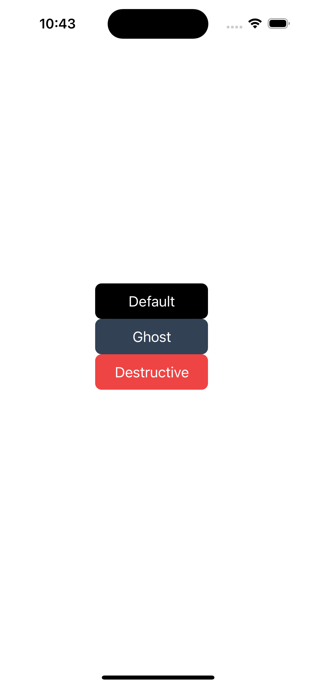

# nativecn-ui

shadcn/ui components for React Native

## Usage

Copy-paste `components` into your project. No need to install any package

## Components

- [x] Badge
- [x] Button
- [ ] Avatar (WIP)
- [ ] Card (WIP)
- [ ] Input (WIP)
- [ ] Tabs (WIP)
